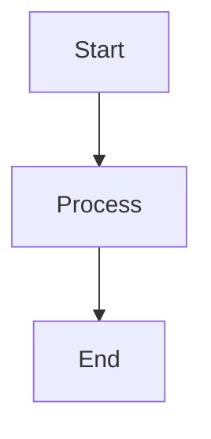

# Mermaid Diagram Test

This is a sample Markdown file to test Mermaid rendering:

```mermaid
graph TD;
    A[Start] --> B[Process];
    B --> C[End];
```

If the configuration is correct, you'll see a flowchart rendered when using `:MarkdownPreview`.
