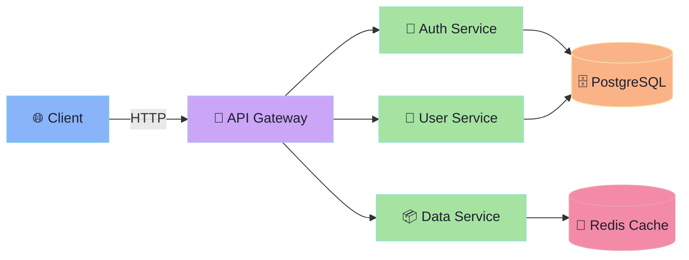
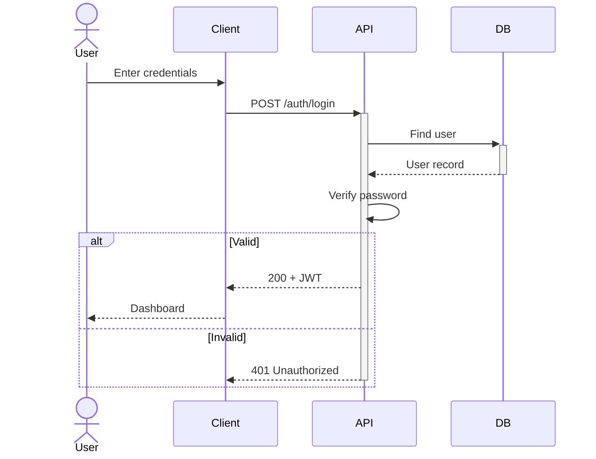
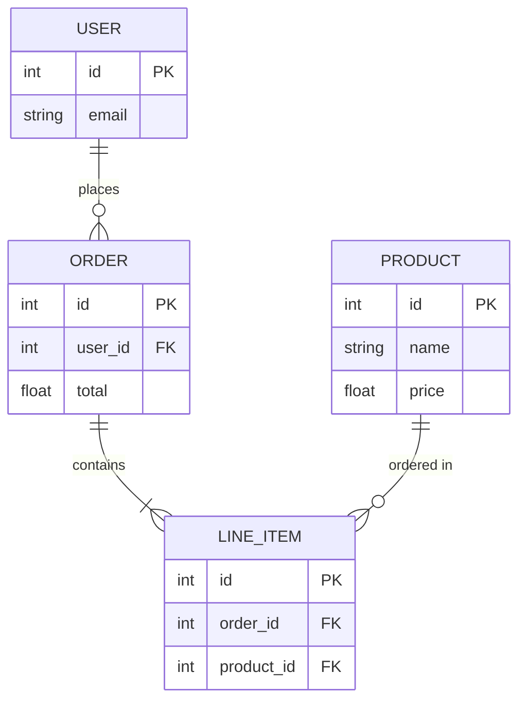
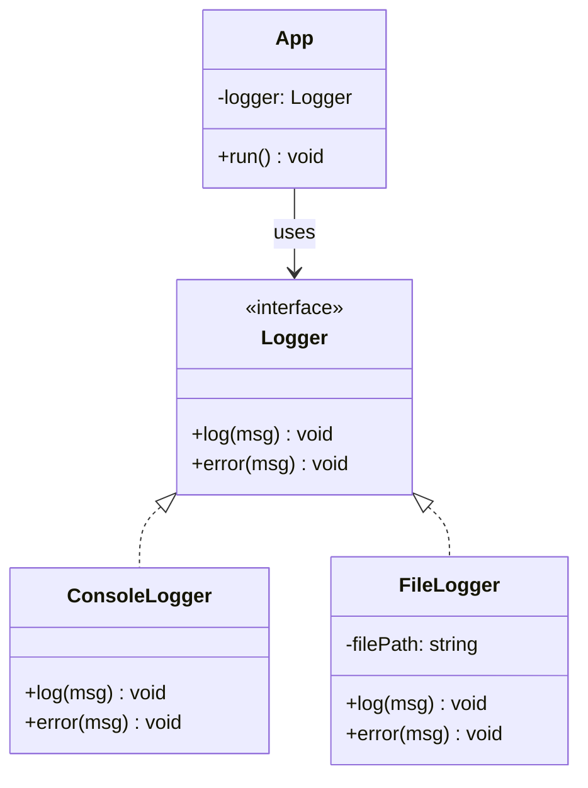
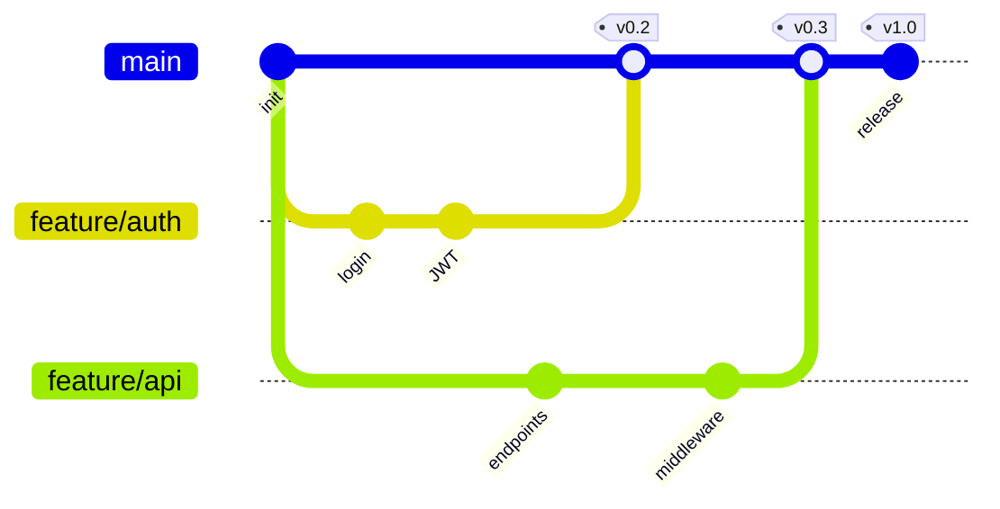
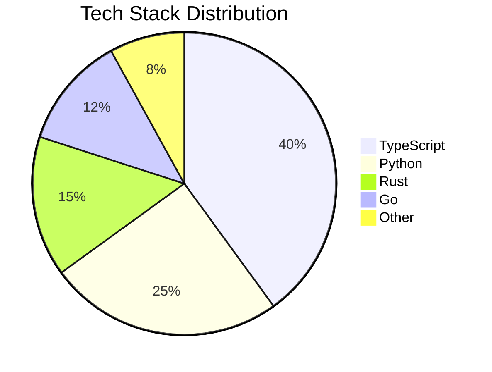
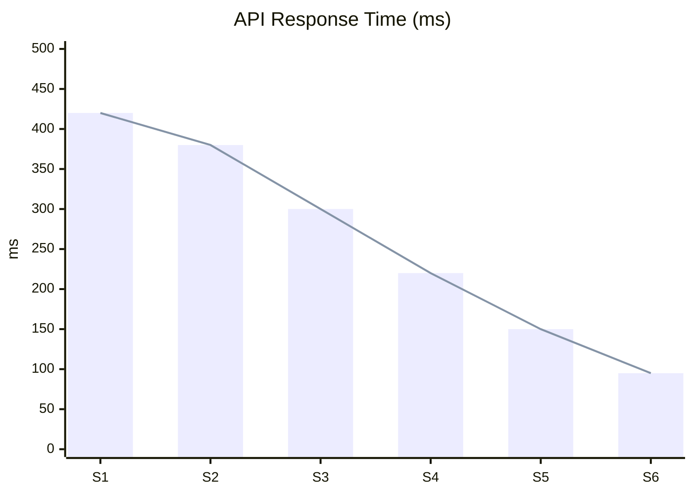
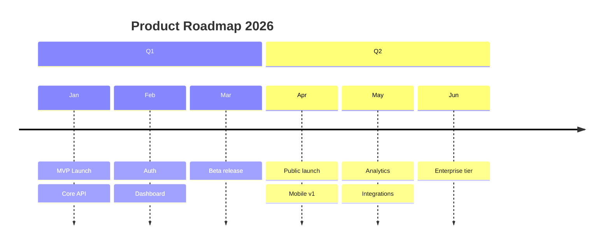
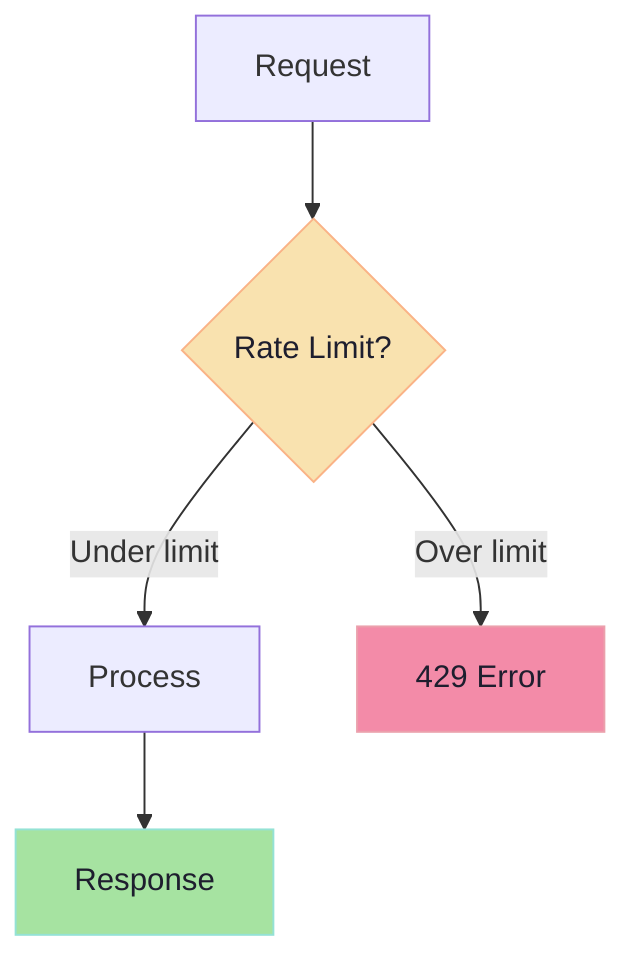

<style>
@import './style/catppuccin-mocha.css';
</style>

# Welcome to My Dev Talk 🚀

Powered by **Slidev** + **Catppuccin Mocha** 🐱

<style>
h1 {
  color: #cdd6f4 !important;
}
</style>

---

# Code Highlighting — TypeScript

Step-by-step line highlighting with click:

```ts {1-2|4-6|8|all} {lines:true}
// Define a generic Result type
type Result<T, E = Error> = { ok: true; value: T } | { ok: false; error: E }

function divide(a: number, b: number): Result<number, string> {
  if (b === 0) return { ok: false, error: 'Division by zero' }
  return { ok: true, value: a / b }
}

const result = divide(10, 3)
```

---

# Code Highlighting — Python

```python {lines:true}
from dataclasses import dataclass
from typing import Optional

@dataclass
class Developer:
    name: str
    language: str
    coffee_level: int = 100

    def code(self) -> Optional[str]:
        if self.coffee_level > 0:
            self.coffee_level -= 10
            return f"{self.name} writes beautiful {self.language}"
        return None
```

---
layout: two-cols
layoutClass: gap-8
---

# Left: Explanation

This layout splits content into **two columns**.

Perfect for:
- 📝 Explaining code
- 🔄 Showing before/after
- 📊 Comparing approaches

::right::

# Right: Code

```js {lines:true}
// Reactive state management
const state = reactive({
  count: 0,
  doubled: computed(() =>
    state.count * 2
  ),
})

function increment() {
  state.count++
}
```

---

# Shell Commands

```bash {lines:true}
# Setup a new project
pnpm create slidev@latest my-talk
cd my-talk

# Dev mode with hot reload
pnpm dev

# Export to PDF
pnpm slidev export

# Build for static hosting
pnpm slidev build
```

---

# Diagrams — Flowchart

Architecture overview with Mermaid:



---

# Diagrams — Sequence



---

# Diagrams — ER Diagram



---

# Diagrams — Class Diagram



---

# Diagrams — Git Graph



---

# Charts — Pie



---

# Charts — Bar & Line



---

# Charts — Timeline



---

# Tables — Markdown

Simple and clean:

| Feature | Status | Priority | Owner |
|---------|--------|----------|-------|
| Authentication | ✅ Done | 🔴 High | @alice |
| REST API | ✅ Done | 🔴 High | @bob |
| WebSocket | 🔄 WIP | 🟡 Medium | @charlie |
| Dashboard UI | 🔄 WIP | 🟡 Medium | @alice |
| Mobile App | ❌ Todo | 🟢 Low | @bob |
| CI/CD Pipeline | ✅ Done | 🔴 High | @charlie |
| Documentation | 🔄 WIP | 🟡 Medium | @alice |

---

# Tables — Styled HTML

<table style="width:100%; border-collapse: collapse; font-size: 0.9em;">
  <thead>
    <tr style="background: #313244; color: #cdd6f4;">
      <th style="padding: 12px; text-align: left;">Service</th>
      <th style="padding: 12px; text-align: center;">Status</th>
      <th style="padding: 12px; text-align: right;">Uptime</th>
      <th style="padding: 12px; text-align: right;">Latency</th>
    </tr>
  </thead>
  <tbody>
    <tr style="background: #1e1e2e; border-bottom: 1px solid #45475a;">
      <td style="padding: 10px;">🚪 API Gateway</td>
      <td style="padding: 10px; text-align: center;">🟢 Healthy</td>
      <td style="padding: 10px; text-align: right; color: #a6e3a1;">99.98%</td>
      <td style="padding: 10px; text-align: right; color: #a6e3a1;">12ms</td>
    </tr>
    <tr style="background: #181825; border-bottom: 1px solid #45475a;">
      <td style="padding: 10px;">🔐 Auth Service</td>
      <td style="padding: 10px; text-align: center;">🟢 Healthy</td>
      <td style="padding: 10px; text-align: right; color: #a6e3a1;">99.95%</td>
      <td style="padding: 10px; text-align: right; color: #f9e2af;">45ms</td>
    </tr>
    <tr style="background: #1e1e2e; border-bottom: 1px solid #45475a;">
      <td style="padding: 10px;">👤 User Service</td>
      <td style="padding: 10px; text-align: center;">🟡 Degraded</td>
      <td style="padding: 10px; text-align: right; color: #f9e2af;">98.50%</td>
      <td style="padding: 10px; text-align: right; color: #f38ba8;">230ms</td>
    </tr>
    <tr style="background: #181825;">
      <td style="padding: 10px;">📦 Data Service</td>
      <td style="padding: 10px; text-align: center;">🟢 Healthy</td>
      <td style="padding: 10px; text-align: right; color: #a6e3a1;">99.99%</td>
      <td style="padding: 10px; text-align: right; color: #a6e3a1;">8ms</td>
    </tr>
  </tbody>
</table>

---

# Grid — Dashboard Cards

<div class="grid grid-cols-3 gap-4 mt-4">
  <div style="background: #313244; padding: 20px; border-radius: 12px; border-left: 4px solid #a6e3a1;">
    <div style="color: #a6adc8; font-size: 0.8em;">Total Users</div>
    <div style="color: #cdd6f4; font-size: 2em; font-weight: bold;">12,847</div>
    <div style="color: #a6e3a1; font-size: 0.8em;">↑ 12.5% vs last month</div>
  </div>
  <div style="background: #313244; padding: 20px; border-radius: 12px; border-left: 4px solid #89b4fa;">
    <div style="color: #a6adc8; font-size: 0.8em;">API Requests</div>
    <div style="color: #cdd6f4; font-size: 2em; font-weight: bold;">1.2M</div>
    <div style="color: #89b4fa; font-size: 0.8em;">↑ 8.3% vs last month</div>
  </div>
  <div style="background: #313244; padding: 20px; border-radius: 12px; border-left: 4px solid #f38ba8;">
    <div style="color: #a6adc8; font-size: 0.8em;">Error Rate</div>
    <div style="color: #cdd6f4; font-size: 2em; font-weight: bold;">0.12%</div>
    <div style="color: #a6e3a1; font-size: 0.8em;">↓ 0.05% vs last month</div>
  </div>
</div>

<div class="grid grid-cols-2 gap-4 mt-4">
  <div style="background: #313244; padding: 20px; border-radius: 12px; border-left: 4px solid #cba6f7;">
    <div style="color: #a6adc8; font-size: 0.8em;">Avg Response Time</div>
    <div style="color: #cdd6f4; font-size: 2em; font-weight: bold;">45ms</div>
    <div style="color: #a6e3a1; font-size: 0.8em;">↓ 15ms improvement</div>
  </div>
  <div style="background: #313244; padding: 20px; border-radius: 12px; border-left: 4px solid #fab387;">
    <div style="color: #a6adc8; font-size: 0.8em;">Deploy Frequency</div>
    <div style="color: #cdd6f4; font-size: 2em; font-weight: bold;">4.2/day</div>
    <div style="color: #89b4fa; font-size: 0.8em;">↑ from 2.8/day</div>
  </div>
</div>

---

# Grid — Tech Comparison

<div class="grid grid-cols-2 gap-6 mt-4">
  <div style="background: #313244; padding: 20px; border-radius: 12px;">
    <h3 style="color: #89b4fa; margin-top: 0;">⚡ Bun</h3>
    <ul style="color: #bac2de; font-size: 0.85em;">
      <li>All-in-one runtime</li>
      <li>Built-in bundler & test runner</li>
      <li>Fastest startup time</li>
      <li>Drop-in Node replacement</li>
    </ul>
    <div style="color: #a6e3a1; font-size: 0.8em; margin-top: 8px;">Best for: New projects, speed-critical</div>
  </div>
  <div style="background: #313244; padding: 20px; border-radius: 12px;">
    <h3 style="color: #fab387; margin-top: 0;">🦕 Deno</h3>
    <ul style="color: #bac2de; font-size: 0.85em;">
      <li>Secure by default</li>
      <li>Native TypeScript</li>
      <li>Web-standard APIs</li>
      <li>Built-in formatter & linter</li>
    </ul>
    <div style="color: #a6e3a1; font-size: 0.8em; margin-top: 8px;">Best for: Security-focused, web standards</div>
  </div>
  <div style="background: #313244; padding: 20px; border-radius: 12px;">
    <h3 style="color: #a6e3a1; margin-top: 0;">🟢 Node.js</h3>
    <ul style="color: #bac2de; font-size: 0.85em;">
      <li>Largest ecosystem (npm)</li>
      <li>Battle-tested in production</li>
      <li>Massive community</li>
      <li>Enterprise adoption</li>
    </ul>
    <div style="color: #a6e3a1; font-size: 0.8em; margin-top: 8px;">Best for: Enterprise, existing projects</div>
  </div>
  <div style="background: #313244; padding: 20px; border-radius: 12px;">
    <h3 style="color: #f5c2e7; margin-top: 0;">🌐 Cloudflare Workers</h3>
    <ul style="color: #bac2de; font-size: 0.85em;">
      <li>Edge computing (0ms cold start)</li>
      <li>Global distribution</li>
      <li>V8 isolates</li>
      <li>Built-in KV & D1</li>
    </ul>
    <div style="color: #a6e3a1; font-size: 0.8em; margin-top: 8px;">Best for: Edge, low-latency APIs</div>
  </div>
</div>

---
layout: two-cols
layoutClass: gap-8
---

# Diagram + Code

Combine visuals with implementation:



::right::

# &nbsp;

```ts {lines:true}
const rateLimit = (
  max: number,
  windowMs: number
) => {
  const hits = new Map<string, number[]>()

  return (req: Request) => {
    const ip = req.headers
      .get('x-forwarded-for') ?? 'unknown'
    const now = Date.now()
    const window = hits.get(ip)
      ?.filter(t => t > now - windowMs)
      ?? []

    if (window.length >= max) {
      return new Response(
        'Too Many Requests',
        { status: 429 }
      )
    }

    hits.set(ip, [...window, now])
  }
}
```

---
layout: center
---

# Thank You! 🎉

Made with ❤️ using [Slidev](https://sli.dev)

<style>
h1 {
  font-size: 3em !important;
  color: #cdd6f4 !important;
}
</style>
